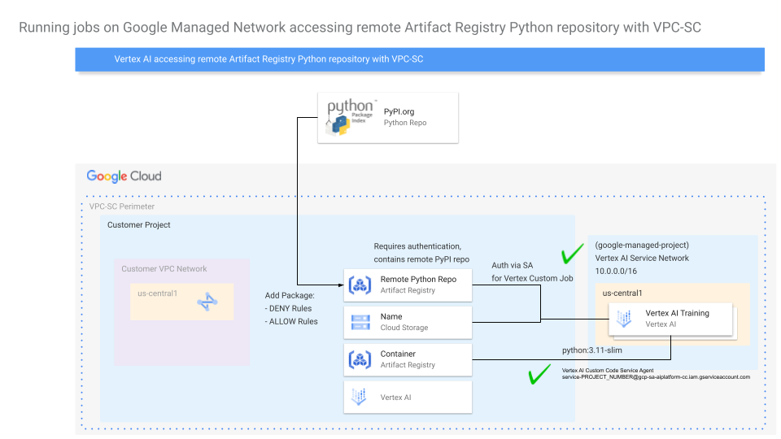

```
# Copyright 2025 Google LLC
#
# Licensed under the Apache License, Version 2.0 (the "License");
# you may not use this file except in compliance with the License.
# You may obtain a copy of the License at
#
#     https://www.apache.org/licenses/LICENSE-2.0
#
# Unless required by applicable law or agreed to in writing, software
# distributed under the License is distributed on an "AS IS" BASIS,
# WITHOUT WARRANTIES OR CONDITIONS OF ANY KIND, either express or implied.
# See the License for the specific language governing permissions and
# limitations under the License.
```

# Vertex AI Pipelines: Configure Private Artifact Registry Python Repository and setup KFP Base Image

| Author(s) |
| --- |
| [Jose Brache](https://github.com/jbrache) |

## Overview

When using [Vertex AI Pipelines](https://cloud.google.com/vertex-ai/docs/pipelines/introduction) you may want to authenticate with a Python Package Index (PyPI) repository hosted on Artifact Registry.

This guide shows how to set up configure a [remote PyPI repository](https://cloud.google.com/artifact-registry/docs/repositories/remote-repo) and authenticate to it with Vertex AI Pipelines to install Python packages. Kubeflow exposes [`pip_index_urls`](https://www.kubeflow.org/docs/components/pipelines/user-guides/components/lightweight-python-components/#pip_index_urls) providing the ability to pip install `packages_to_install` from package indices other than the default [PyPI.org](PyPI.org).

Python Package Index (PyPI) is a public repository for Python packages. You can use Artifact Registry to create a remote repositories for your Python packages using the Python Package Index (PyPI) as an external source.

A remote repository acts as a proxy for the upstream source so that you have more control over your dependencies. The first time that you request a version of a package, Artifact Registry downloads and caches the package in the remote repository. The next time you request the same package version, Artifact Registry serves the cached copy.

The following diagram describes how Vertex AI Pipelines can access a remote Artifact Registry Python repository without network egress (using VPC Peering or PSC-I):


Review the public docs for the latest information on support:
- [Artifact Registry Python repository](https://cloud.google.com/artifact-registry/docs/python/store-python)
- [Configure authentication to Artifact Registry for Python package repositories](https://cloud.google.com/artifact-registry/docs/python/authentication)
- [Create remote repositories](https://cloud.google.com/artifact-registry/docs/repositories/remote-repo)
- [Configure remote repository authentication to the Python Package Index (PyPI)](https://cloud.google.com/artifact-registry/docs/python/configure-remote-auth-pypi)

This example covers the following steps:
1. Create a remote PyPI repository with the upstream set to `pypi.org`
2. Create a default DENY rule to download packages
3. Create a ALLOW rules for a list of packages
4. **Optional if done in [0_Configure_Private_Artifact_Registry.md](0_Configure_Private_Artifact_Registry.md)**: Create KFP Base Image, configured to authenticate to Artifact Registry
5. **Optional if done in [0_Configure_Private_Artifact_Registry.md](0_Configure_Private_Artifact_Registry.md)**: Build and Push Custom Container to Artifact Registry
6. Summary and Next steps: Run through the [Vertex AI Pipelines Introduction](1_Vertex_AI_Pipelines_Introduction.ipynb) notebook to use the remote Artifact Registry Python repository and base container image with Vertex AI Pipelines.

# 0-0. Set Google Cloud project information

To get started using Vertex AI, you must have an existing Google Cloud project and [enable the Vertex AI API](https://console.cloud.google.com/flows/enableapi?apiid=aiplatform.googleapis.com).

Learn more about [setting up a project and a development environment](https://cloud.google.com/vertex-ai/docs/start/cloud-environment).

```sh
export PROJECT_ID="ds-dev-jb02-pypi"
# For the Artifact Registry Python repository
export REPOSITORY="python-remote-repo"
export LOCATION="us-central1"
export DESCRIPTION="Remote Python repository"
export UPSTREAM="https://pypi.org"
export RULE_NAME_PREFIX="python-remote-repo"

# For the Artifact Registry container image repository
export REGION='us-central1'
export PRIVATE_REPO="kfp-base-images"
```

```sh
gcloud config set project $PROJECT_ID
```
Set environment variable for Project Number
```sh
export PROJECT_NUMBER="$(gcloud projects describe $PROJECT_ID --format="value(projectNumber)")"
```

## 0-1. Enable APIs
The following APIs are enabled in this demo:
1. [Enable the Vertex AI API](https://console.cloud.google.com/flows/enableapi?apiid=aiplatform.googleapis.com)
2. [Enable the Cloud Build API](https://console.cloud.google.com/flows/enableapi?apiid=cloudbuild.googleapis.com)
3. [Enable the Artifact Registry API](https://console.cloud.google.com/flows/enableapi?apiid=artifactregistry.googleapis.com): You must enable the Artifact Registry API for your project. You will store your custom training container in Artifact Registry. [Learn more about Enabling the Artifact Registry service](https://cloud.google.com/artifact-registry/docs/enable-service)

```sh
############# Enable the APIs for Vertex AI Project ########################
gcloud services enable --project=$PROJECT_ID aiplatform.googleapis.com artifactregistry.googleapis.com cloudbuild.googleapis.com
```

## 0-2. IAM Grants
Grant storate object viewer role to the default compute engine service account.

```sh
gcloud projects add-iam-policy-binding $PROJECT_ID \
    --member="serviceAccount:$PROJECT_NUMBER-compute@developer.gserviceaccount.com" \
    --role="roles/storage.objectViewer"
```

# 1-0. Create a repository
This section shows you how to set up a Artifact Registry Python remote repository with an upstream set to `pypi.org`. See the public docs: [Create remote repositories](https://cloud.google.com/artifact-registry/docs/repositories/remote-repo#python) for more information on these steps. You can also complete these steps in a Cloud Shell from the Google Cloud Console.

## 1-1. Create the repository for your packages.
Run the following command to create a new Python package repository in the current project named `python-remote-repo` in the location `us-central1`.

```sh
gcloud artifacts repositories create $REPOSITORY \
    --project=$PROJECT_ID \
    --repository-format=python \
    --location=$LOCATION \
    --description="$DESCRIPTION" \
    --mode=remote-repository \
    --remote-repo-config-desc="PyPI" \
    --disable-vulnerability-scanning \
    --remote-python-repo=$UPSTREAM
```

Run the following command to verify that your repository was created:

```sh
gcloud artifacts repositories list
```

To simplify gcloud commands, set the default repository to `python-remote-repo` and the default location to `us-central1`. After the values are set, you do not need to specify them in `gcloud` commands that require a repository or a location.

To set the repository and location, run the commands:
```sh
gcloud config set artifacts/repository $REPOSITORY
gcloud config set artifacts/location $LOCATION
```

## 1-2. Configure authentication

The Artifact Registry keyring backend finds your credentials using Application Default Credentials (ADC), a strategy that looks for credentials in your environment.

To generate credentials for ADC, run the following command:
```sh
gcloud auth application-default login
```

For details on authentication methods and adding repositories to pip and Twine configuration, see [Setting up authentication to Python package repositories](https://cloud.google.com/artifact-registry/docs/python/authentication).

# 2-0. Configure Python interpreter
Since the Vertex AI Pipelines job in future steps uses an image with Python 3.11, these steps configure a Python 3.11 with [pyenv](https://github.com/pyenv/pyenv) to download source distributions.

## 2-1. Installing Pyenv

Public docs reference which contain other options: [Getting Pyenv](https://github.com/pyenv/pyenv). This just uses the automatic installer for Linux:
```sh
curl -fsSL https://pyenv.run | bash
```

## 2-2. Set up your shell environment for Pyenv
Public docs reference which contain other options: [Set up your shell environment for Pyenv](https://github.com/pyenv/pyenv). This option is for `Bash`:
```sh
export PYENV_ROOT="$HOME/.pyenv"
[[ -d $PYENV_ROOT/bin ]] && export PATH="$PYENV_ROOT/bin:$PATH"
eval "$(pyenv init - bash)"
```

## 2-3. Install and Set Python Version
Since `Python 3.11` is used in our base container image in future steps, these steps install `Python 3.11` and set it as the default version:

Intall Python 3.11
```sh
pyenv install 3.11
```

Set Python 3.11 as the default version
```sh
pyenv global 3.11
```

## 2-4. Install required packages
In this guide you use the Python installation configured with `Pyenv`. You will also need to install the [Artifact Registry keyring backend](https://pypi.org/project/keyrings.google-artifactregistry-auth):
to handle authentication with Artifact Registry. If you create
a [virtual environment](https://docs.python.org/3/tutorial/venv.html) or set up Python outside of `Pyenv` you must install the keyring backend for authentication.
For details, see [Authenticating with keyring](https://cloud.google.com/artifact-registry/docs/python/authentication#keyring).

To install the keyring backend, run the commands:
```sh
pip install keyring --upgrade
pip install keyrings.google-artifactregistry-auth --upgrade
```

You are now ready to set up Artifact Registry.

# 3-0. Configure Artifact Registry Download Rules
This section describes how to restrict artifact downloads from your Artifact Registry repositories by creating and managing download rules.

Download rules let you allow or deny artifact downloads from your repositories and packages. You can also set conditions so the rule applies to specific tags or versions.

For details, review the public docs: [Restrict artifact downloads with download rules](https://cloud.google.com/artifact-registry/docs/restrict-artifact-downloads).

## 3-1. [Optional] Set a default `DENY` rule

Run the following command:
```sh
## Deny All Packages by Default
gcloud artifacts rules create $RULE_NAME_PREFIX-deny-all \
    --action=DENY \
    --project=$PROJECT_ID \
    --location=$LOCATION \
    --repository=$REPOSITORY

# gcloud artifacts rules delete $RULE_NAME_PREFIX-deny-all \
#     --project=$PROJECT_ID \
#     --location=$LOCATION \
#     --repository=$REPOSITORY
```

## 3-2. [Optional] Create an `ALLOW` rule for a list of packages

Create a list of packages to allow.
```sh
## declare an array of allowed packages
declare -a allow_arr=( \
    "annotated-types" \
    "anyio" \
    "cachetools" \
    "certifi" \
    "charset-normalizer" \
    "google-auth" \
    "google-genai" \
    "h11" \
    "httpcore" \
    "httpx" \
    "idna" \
    "kfp" \
    "pyasn1" \
    "pyasn1-modules" \
    "pydantic" \
    "pydantic-core" \
    "requests" \
    "rsa" \
    "sniffio" \
    "typing-extensions" \
    "typing-inspection" \
    "urllib3" \
    "websockets" \
)
```

Run the following command to create an `ALLOW` rule for a list of packages
```sh
# loop through the above array
for i in "${allow_arr[@]}"; do
    echo "$i"
    if ! gcloud artifacts rules create $RULE_NAME_PREFIX-$i \
        --action=ALLOW \
        --project=$PROJECT_ID \
        --location=$LOCATION \
        --repository=$REPOSITORY \
        --package=$i
    then
        continue
    fi
done
```

List the rules in the repository:
```sh
gcloud artifacts rules list \
    --project=$PROJECT_ID \
    --location=$LOCATION \
    --repository=$REPOSITORY
```

**Optional** if you also want to delete the rules
```sh
# loop through the above array to delete all the rules
for i in "${allow_arr[@]}"; do
    echo "$i"
    if ! gcloud artifacts rules delete $RULE_NAME_PREFIX-$i \
        --project=$PROJECT_ID \
        --location=$LOCATION \
        --repository=$REPOSITORY
    then
        continue
    fi
done
```

## 3-3. [Optional] Install the package
Run the following command to install the package:
```sh
export PACKAGE="google-genai"
pip install --index-url https://us-central1-python.pkg.dev/$PROJECT_ID/$REPOSITORY/simple/ $PACKAGE
```

## 3-4. [Optional] View the package in the repository
To verify that your package was added, list the packages in the `python-remote-repo` repository.

Run the following command:
```sh
gcloud artifacts packages list --repository=$REPOSITORY
```

To view versions for a package, run the following command:
```sh
export PACKAGE="google-genai"
gcloud artifacts versions list --package=$PACKAGE
```
Where `PACKAGE` is the package ID.

**Troubleshooting**: By default, tools such as `pip` and Twine do not return detailed error messages. If you encounter an error, rerun the command with the `--verbose` flag to get more detailed output. See [Troubleshooting for Python packages](https://cloud.google.com/artifact-registry/docs/troubleshooting#pypi) for more information.

# 4-0. Create KFP Base Image

```sh
# Training code container def
export CONTAINER_DIR="kfp_container"
```

Create the location where the container Dockerfile will be stored
```sh
# Remove if there's any such folder already
rm -rf $CONTAINER_DIR
# Create your app directory
mkdir -p $CONTAINER_DIR
```

Create the Dockerfile
```sh
cat > $CONTAINER_DIR/Dockerfile <<EOF
FROM python:3.11-slim

WORKDIR /app

RUN pip install --no-cache-dir kfp==2.12.1 pandas google-cloud-aiplatform
# Used for authenticating to Artifact Registry
RUN pip install --no-cache-dir keyring keyrings.google-artifactregistry-auth

COPY . /app

CMD ["echo", "Kubeflow base image built successfully"]
EOF
```

## 4-1. Build and Push Custom Container to Artifact Registry

You must have enabled the Artifact Registry API for your project in the previous steps. You will store your custom training container in Artifact Registry.

### 4-1-1. Create a private Docker repository
Your first step is to create a Docker repository in Artifact Registry.

1 - Run the `gcloud artifacts repositories create` command to create a new Docker repository with your region with the description `Docker repository`.

2 - Run the `gcloud artifacts repositories list` command to verify that your repository was created.

```sh
# Repo to create / use for running training job

export BASE_IMAGE="${REGION}-docker.pkg.dev/${PROJECT_ID}/${PRIVATE_REPO}/python-3.11-slim:latest"

echo "Private Repo:", $PRIVATE_REPO
echo "Training Container Image:", $BASE_IMAGE
```

```sh
gcloud artifacts repositories create ${PRIVATE_REPO} --repository-format=docker --project=${PROJECT_ID} --location=${REGION} --description="Docker repository"
```

```sh
gcloud artifacts repositories --project=${PROJECT_ID} list
```

### 4-1-2. Build and push the custom docker container image by using Cloud Build

Build and push a Docker image with Cloud Build
```sh
cd $CONTAINER_DIR && gcloud builds submit --timeout=1800s --project=${PROJECT_ID} --region=${REGION} --tag ${BASE_IMAGE}
```

# 5-0. Summary

In this guide you learned how to
1. Create a remote PyPI repository with the upstream set to `pypi.org`
2. Create a default DENY rule to download packages
3. Create a ALLOW rules for a list of packages

The next step is to use the configured repositories in Vertex AI Pipelines: [Vertex AI Pipelines Introduction](1_Vertex_AI_Pipelines_Introduction.ipynb).
