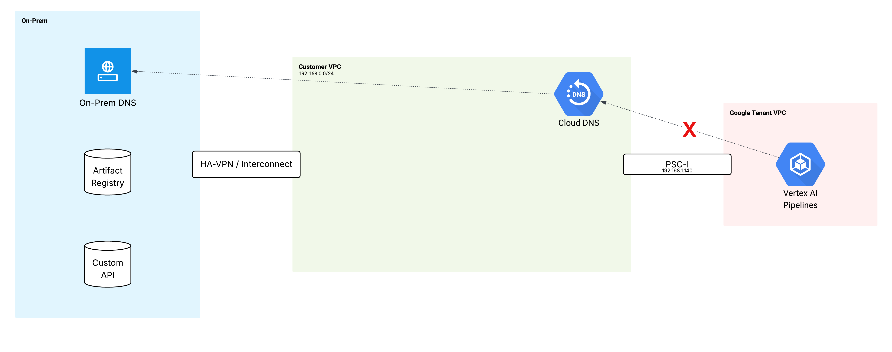
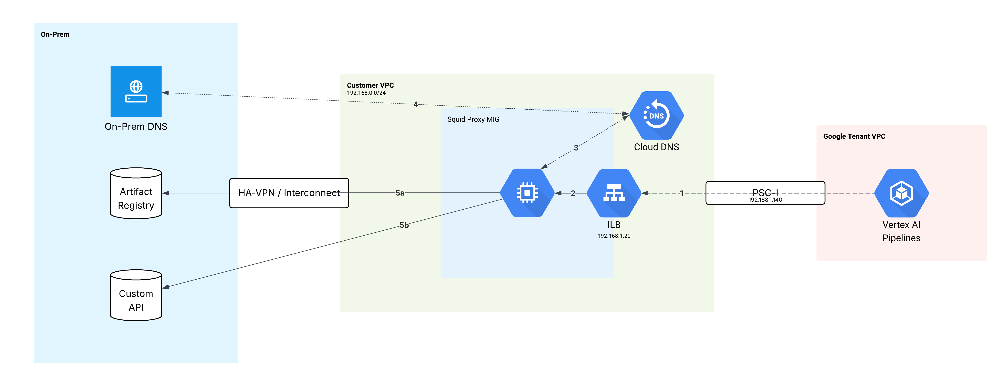

# Reaching private DNS based HTTP services from Vertex

While many Vertex Pipelines can be self contained, there are use cases when the pipeline code needs to reach a private endpoint hosted in a customer VPC or in their on-prem environment.  Common examples include:

- Customer HTTP APIs
- Internal Python package repositories
- NFS shares containing datasets or configuration
- Relational or analytics databases

Enabling this connectivity is known as Network Access.

## Network Access Options

Vertex Pipelines currently supports two methods of providing Network Access.

### 1. Private Service Access

This is also known as VPC networking peering.

Underneath the hood, PSA [peers](https://cloud.google.com/vpc/docs/vpc-peering) the customer VPC with the Google tenant VPC running the pipeline job.  This allows for bi-directional communication between the VPCs but comes with some drawbacks.

1. Large blocks of internal IPs must be allocated to set up PSA.  This can be challenging for organizations with complex networks.  It is common for bigger organizations to be at the point of RFC1918 exhaustion.

2. There is a limit to the number of peers a VPC may have.

3. Transitive routing is not supported via VPC peering.  Specifically, given three VPCs peered as such: VPC1<->VPC2<->VPC3, VPC1 cannot reach services in VPC3 and visa versa.  This can lead to limitations in which services Vertex can reach in enterprise VPC topologies.

### 2. Private Service Connect Interfaces

The Vertex PSC-I builds on top of the underlying [PSC-I](https://cloud.google.com/vpc/docs/about-private-service-connect-interfaces) service.  In short, PSC-I allows a VM in an entirely different org to attach a NIC to the customer (consumer) VPC.


Though PSC-I is a bidirectional network technology, the Vertex implmentation only facilitates *egress* from Vertex Pipelines to customer networks.

PSC-I based network access addresses all of the previously mentioned challenges with PSA:

1. Only requires small IP block allocations - typically a /28 per region.
2. The interface attachments can scale substantially higher than the limit of VPC Peers.
3. Transitive connectivity is supported such that any services the customer/consumer VPC can reach through interconnect, VPN or peering are also reachable by Vertex pipelines.

However, unlike PSA, PSC-I network access currently does not support resolving DNS records from private or internal DNS servers on the customer VPC.  This can lead to challenges reaching HTTP based services which may have a dynamic IP address or rely on HTTP host headers to route traffic correctly.

## Workaround

The problem presented by PSC-I's current limitation is not novel.  At an abstract level, the issue is communicating between two discontiguous networks where the client can only take a narrow path into the service network.  Resources inside the service network are able to reach anything with network line of sight, including DNS.

If Vertex had a way to ask a server to perform a DNS lookup and connection on _behalf_ of the client, we'd have way forward.  Fortunately, this is exactly what [proxy servers](https://en.wikipedia.org/wiki/Proxy_server) do.

In particular, this scenario can be handled by a forward proxy.  Two commonly used forward proxies are [tinyproxy](https://tinyproxy.github.io/) and [squid](https://www.squid-cache.org/).

For our solution, we'll use tinyproxy.

### Starting point

To begin with, here is a simplified VPC topology showing the vertex training jobs and other infrastructure



On the left, we have an on-prem DNS server responsible for resolving local resources such as a custom API and a python repository.

In the middle, a rather empty transit VPC.  However, Cloud DNS is configured to forward DNS requests to the on-prem DNS server.  While a VM in the green VPC would be able to resolve the artifact registry, Vertex cannot.  The DNS requests are not sent through the green VPC, thus the on-prem services are not easily reached.

While we could hard code on-prem IPs into our pipelines to pull things like dependences, this may not work due to load balancing in front of the repository or IP changes which are typically transparent to clients.  Instead, we will deploy our own proxy layer with a well known IP.  While we will still be referencing an IP from our pipeline configuration, we can use a static reservation and protect it from unexpected changes.  Since the single purpose is proxying requests from Vertex, it is unlikely to be changed without our knowledge.

### Solution Topology

Here is what we will be deploying and how the traffic flow will work.



1. A [Managed Instance Group](https://cloud.google.com/compute/docs/instance-groups) of Compute Engine VMs.  MIGs perform automatic deployment, updates and repair, minimizing our operational overhead and providing tight integration to GCP Load Balancing.  We will run 3 instances to ensure high availability.
2. A Load Balancer, configured to send traffic to our proxy VMs.
3. Our vertex pipelines will be configured to run with an environment variable `https_proxy=[load balancer ip]:3128`.  This instructs HTTP clients running in our pipeline to use the load balancer as a  proxy for all HTTPS requests.


When a new HTTP request is sent, it will take the path depicted in the diagram.

1. The client connects to the ILB, which proxies the connection to one of the backend proxy instances.
2. The request is sent to the proxy and contains a request to connect to one of the on-prem services by name (ex: mypythonstuff.example.com).
3. The _proxy_ VM - not the HTTP client in Vertex - makes a DNS request to resolve `mypythonstuff.example.com`.
4. Cloud DNS forwards the query to on-prem and recieves and answer, passing the information back to the proxy VM.
5. The _proxy_ VM completes the HTTP connection to the resolved IP and either passes the original request along or (in the case of HTTPS) links the incoming client coonnection to the upstream service over an HTTP CONNECT tunnel.

The response from the upstream service is then returned to the client.

It's worth noting that this solution uses an HTTP proxy but could also use a [SOCKS](https://en.wikipedia.org/wiki/SOCKS) based proxy if non-HTTP protocols were required and the clients on the Vertex side supported SOCKS proxies.

### Deployment Steps


#### Variables

```sh
# Customize for your environment
FORWARDING_RULE_IP="192.168.10.27"
SUBNET_NAME="us-central1-vertex-psci"
NETWORK="vertex-vpc-prod"
REGION="us-central1"

# Other variables
INSTANCE_TEMPLATE_NAME="proxy-template"
MIG_NAME="proxy-rmig"
HEALTH_CHECK_NAME="proxy-hc"
BACKEND_SERVICE_NAME="proxy-backend-service"
FORWARDING_RULE_NAME="proxy-forwarding-rule"
STATIC_IP_NAME="proxy-lb-ip"
NETWORK_TAG="proxy"

```

#### Setup


1. Create instance template
```sh
gcloud compute instance-templates create "${INSTANCE_TEMPLATE_NAME}" \
    --region="${REGION}" \
    --network-interface=subnet="${SUBNET_NAME}",no-address \
    --tags="${NETWORK_TAG}" \
    --machine-type=e2-small \
    --image-family=debian-12 \
    --image-project=debian-cloud \
    --scopes=https://www.googleapis.com/auth/cloud-platform \
    --metadata=startup-script='#! /bin/bash
    # Wait for network config
    sleep 10

    # Install Tinyproxy
    apt-get update -y
    apt-get install -y tinyproxy

    # Configure Tinyproxy
    cat << EOF > /etc/tinyproxy/tinyproxy.conf
# Default user/group for tinyproxy package on Debian
User tinyproxy
Group tinyproxy

# Port to listen on
Port 3128

# Address to listen on (0.0.0.0 for all interfaces)
Listen 0.0.0.0

# Timeout for connections
Timeout 600

# Log file location
LogFile "/var/log/tinyproxy/tinyproxy.log"

# Process ID file location
PidFile "/run/tinyproxy/tinyproxy.pid"

# Max number of clients
MaxClients 100

# Allow RFC1918 networks
Allow 10.0.0.0/8
Allow 172.16.0.0/12
Allow 192.168.0.0/16

# Deny ALL

# Required for HTTP 1.1
ViaProxyName "tinyproxy"
EOF

    # Ensure log directory exists and has correct permissions
    mkdir -p /var/log/tinyproxy
    chown tinyproxy:tinyproxy /var/log/tinyproxy

    # Restart Tinyproxy
    systemctl restart tinyproxy
    systemctl enable tinyproxy'
```

2. Create health check

```sh
gcloud compute health-checks create tcp "${HEALTH_CHECK_NAME}" \
    --region="${REGION}" \
    --port=3128 \
    --check-interval=10s \
    --timeout=5s \
    --unhealthy-threshold=3 \
    --healthy-threshold=2
```

3. Create firewall rules for healthcheck and incoming traffic

    **Note, the source range off fw-allow-proxy can be restricted to your local VPC subnets

```sh
gcloud compute firewall-rules create fw-allow-proxy \
    --network="${NETWORK}" \
    --direction=INGRESS \
    --priority=1000 \
    --action=ALLOW \
    --rules=tcp:3128 \
    --source-ranges="10.0.0.0/8,172.16.0.0/12,192.168.0.0/16" \
    --target-tags="${NETWORK_TAG}"

gcloud compute firewall-rules create fw-allow-health-check \
    --network="${NETWORK}" \
    --direction=INGRESS \
    --priority=1000 \
    --action=ALLOW \
    --rules=tcp \
    --source-ranges="130.211.0.0/22,35.191.0.0/16" \
    --target-tags="${NETWORK_TAG}"
```

4. Create regional [MIG](https://cloud.google.com/compute/docs/instance-groups#managed_instance_groups) and load balancer backend configuration

```sh

gcloud compute instance-groups managed create "${MIG_NAME}" \
    --region="${REGION}" \
    --size=3 \
    --template="${INSTANCE_TEMPLATE_NAME}"

gcloud compute backend-services create "${BACKEND_SERVICE_NAME}" \
    --load-balancing-scheme=INTERNAL \
    --protocol=TCP \
    --region="${REGION}" \
    --health-checks="${HEALTH_CHECK_NAME}" \
    --health-checks-region="${REGION}"

gcloud compute backend-services add-backend "${BACKEND_SERVICE_NAME}" \
    --region="${REGION}" \
    --instance-group="${MIG_NAME}" \
    --instance-group-region="${REGION}"
```

5. Create load balancer forwarding rule and a static IP

```sh
gcloud compute addresses create "${STATIC_IP_NAME}" \
    --region="${REGION}" \
    --subnet="${SUBNET_NAME}" \
    --addresses="${FORWARDING_RULE_IP}" \
    --purpose=GCE_ENDPOINT

gcloud compute forwarding-rules create "${FORWARDING_RULE_NAME}" \
    --region="${REGION}" \
    --load-balancing-scheme=INTERNAL \
    --address="${STATIC_IP_NAME}" \
    --network="${NETWORK}" \
    --subnet="${SUBNET_NAME}" \
    --ip-protocol=TCP \
    --ports=3128 \
    --backend-service="${BACKEND_SERVICE_NAME}" \
    --backend-service-region="${REGION}"
```

#### Cleanup

```sh
# --- 1. Delete Forwarding Rule ---
gcloud compute forwarding-rules delete "${FORWARDING_RULE_NAME}" \
    --region="${REGION}" \
    --quiet || echo "Forwarding Rule ${FORWARDING_RULE_NAME} not found or already deleted."

# --- 1.5. Delete Static IP Address ---
gcloud compute addresses delete "${STATIC_IP_NAME}" \
    --region="${REGION}" \
    --quiet || echo "Static IP Address ${STATIC_IP_NAME} not found or already deleted."

# --- 2. Delete Backend Service ---
gcloud compute backend-services delete "${BACKEND_SERVICE_NAME}" \
    --region="${REGION}" \
    --quiet || echo "Backend Service ${BACKEND_SERVICE_NAME} not found or already deleted."

# --- 3. Delete Regional Managed Instance Group ---
gcloud compute instance-groups managed delete "${MIG_NAME}" \
    --region="${REGION}" \
    --quiet || echo "MIG ${MIG_NAME} not found or already deleted."

# --- 4. Delete Firewall Rules ---
gcloud compute firewall-rules delete "${FW_RULE_HC}" \
    --quiet || echo "Firewall Rule ${FW_RULE_HC} not found or already deleted."

gcloud compute firewall-rules delete "${FW_RULE_PROXY}" \
    --quiet || echo "Firewall Rule ${FW_RULE_PROXY} not found or already deleted."

# --- 5. Delete Health Check ---
gcloud compute health-checks delete "${HEALTH_CHECK_NAME}" \
    --region="${REGION}" \
    --quiet || echo "Health Check ${HEALTH_CHECK_NAME} not found or already deleted."

# --- 6. Delete Instance Template ---
gcloud compute instance-templates delete "${INSTANCE_TEMPLATE_NAME}" \
    --quiet || echo "Instance Template ${INSTANCE_TEMPLATE_NAME} not found or already deleted."
```
