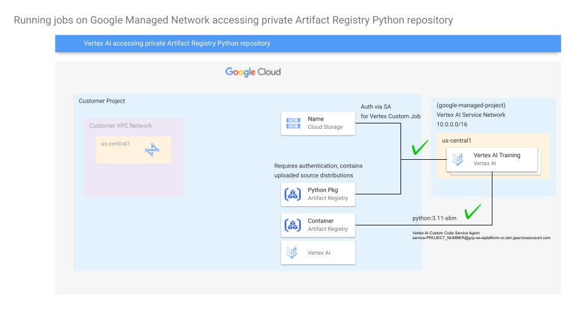

# Overview

When using [Vertex AI Pipelines](https://cloud.google.com/vertex-ai/docs/pipelines/introduction) you may want to authenticate with a Python Package Index (PyPI) repository hosted on Artifact Registry.

This guide shows how to set up configure a private [Artifact Registry Python repository](https://cloud.google.com/artifact-registry/docs/python/store-python) and authenticate to it with Vertex AI Pipelines to install Python packages. Kubeflow exposes [`pip_index_urls`](https://www.kubeflow.org/docs/components/pipelines/user-guides/components/lightweight-python-components/#pip_index_urls) providing the ability to pip install `packages_to_install` from package indices other than the default [PyPI.org](https://pypi.org/).

The following diagram describes how Vertex AI Pipelines can access a private Artifact Registry Python repository without network peering:

## Get Started
1. Setup the pre-requisites with: 
- [0_Configure_Private_Artifact_Registry.md](0_Configure_Private_Artifact_Registry.md)
- [0_Configure_Remote_Artifact_Registry.md](0_Configure_Remote_Artifact_Registry.md) <- Suggested if you want to use a remote PyPI repository: [PyPI.Org](https://pypi.org/)
2. Once you've configured your private Artifact Registry Python repository and custom container base image move to: [1_Vertex_AI_Pipelines_Introduction.ipynb](1_Vertex_AI_Pipelines_Introduction.ipynb)
3. [Optional] If you want to enable VPC Service Controls with Vertex AI, and access your private Artifact Registry Python repository in the previous step move to: [2_VPC_SC_Vertex_AI_Pipelines_Setup.md](2_VPC_SC_Vertex_AI_Pipelines_Setup.md)
4. **Work in progress**: Create a Squid Proxy
5. If you are using PSC-I with Vertex AI Pipelines, move to and have set up a Squid Proxy as a [pip proxy server](https://pip.pypa.io/en/latest/user_guide/#using-a-proxy-server) move to: [5_Vertex_AI_Pipelines_PSC_I_Proxy.ipynb](5_Vertex_AI_Pipelines_PSC_I_Proxy.ipynb)

## Resources
* One of the best resources for getting started with Vertex AI Pipelines: [Orchestration With Pipelines](https://github.com/statmike/vertex-ai-mlops/tree/main/MLOps/Pipelines)
* [Using private Python packages inside a Vertex AI kfp component](https://medium.com/@islam.sadeka/using-private-python-packages-inside-a-vertex-ai-kfp-component-45020f06e44e)
* [Extending network reachability of Vertex AI Pipelines](https://cloud.google.com/blog/products/ai-machine-learning/extending-network-reachability-of-vertex-pipelines)
* [Set up Connectivity from Vertex AI using proxies](https://cloud.google.com/vertex-ai/docs/general/hybrid-connectivity#set_up_connectivity_from_using_proxies)