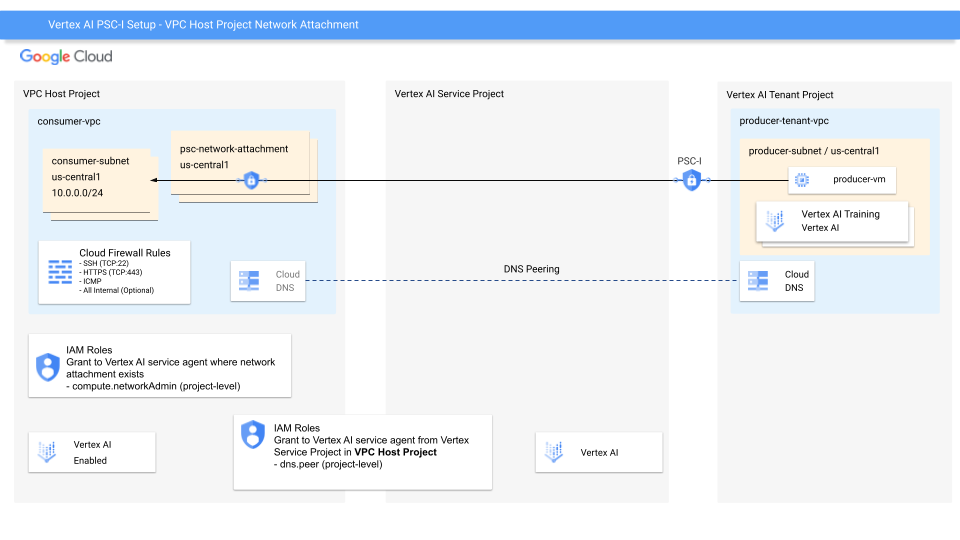
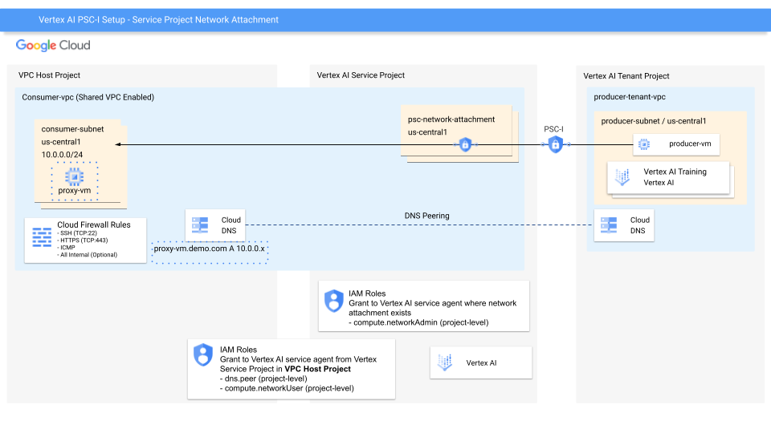

# Vertex AI Private Service Connect Interface - Terraform Configuration

This Terraform configuration automates the setup of a Private Service Connect (PSC) Interface for Vertex AI resources. It supports configuring the **network attachment** in the **VPC Host Project** or the **Vertex AI Service Project** with a Shared VPC architecture. The configuration implements all the required steps from the Google Cloud documentation for configuring a consumer VPC network with PSC interface support for Vertex AI.

## Overview

This Terraform module creates:

1. **VPC Host Project** - Enables Shared VPC on the networking project (when `enable_shared_vpc = true`)
2. **VPC Network** - A custom VPC network for Private Service Connect (in the host project)
3. **Subnet** - A subnet within the VPC network (in the host project)
4. **Network Attachment(s)** - Configured to automatically accept connections for PSC
   - **VPC Host Network Attachment Mode** (`enable_shared_vpc = false`): Created in the VPC Host networking project
   - **Service Project Network Attachment Mode** (`enable_shared_vpc = true`): Created in each Vertex AI service project
5. **Service Project Attachments** - Links Vertex AI service projects to the Shared VPC (when `enable_shared_vpc = true`)
6. **IAM Bindings** - Grants necessary roles to Vertex AI service agents from all service projects
7. **Firewall Rules** - SSH, HTTPS, ICMP, and optionally all internal traffic
8. **DNS Peer Role** - Required for Vertex AI Training and Agent Engine services

## Architecture - VPC Host Network Attachment Mode
The network attachment is in the VPC Host Project


## Architecture - Service Project Network Attachment Mode
The network attachment is in each Vertex AI Service Project


```
┌───────────────────────────────────────────────────────────────────────┐
│  Networking Project (Shared VPC Host)                                 │
│                                                                       │
│  ┌────────────────────────────────────────────────────────────────┐   │
│  │  VPC Network (Custom Mode) - Shared VPC Enabled                │   │
│  │                                                                │   │
│  │  ┌────────────────────────────────────────────────────────┐    │   │
│  │  │  Subnet (Configurable CIDR)                            │    │   │
│  │  │                                                        │    │   │
│  │  │  ┌──────────────────────────────────────────────────┐  │    │   │
│  │  │  │  Network Attachment (ACCEPT_AUTOMATIC)           │  │    │   │
│  │  │  │                                                  │  │    │   │
│  │  │  │                                                  │  │    │   │
│  │  │  │  ┌────────────────────────────────────────────┐  │  │    │   |
│  │  │  │  │  Service Project Attachments               │  │  │    |   │
│  │  │  |  |                                            |  |  │    |   │
│  │  │  │  │  Used by Service Projects                  │  |  │    |   │
│  │  │  │  └────────────────────────────────────────────┘  │  │    │   │
│  │  │  └──────────────────────────────────────────────────┘  │    │   │
│  │  └────────────────────────────────────────────────────────┘    │   │
│  │                                                                │   │
│  │  Firewall Rules:                                               │   │
│  │  - SSH (TCP:22)                                                │   │
│  │  - HTTPS (TCP:443)                                             │   │
│  │  - ICMP                                                        │   │
│  │  - All Internal (Optional)                                     │   │
│  └────────────────────────────────────────────────────────────────┘   │
│                                                                       │
│  IAM Roles (granted to service project service agents):               │
│  - compute.networkAdmin (project-level)                               │
│  - compute.networkUser (subnet-level)                                 │
│  - dns.peer (project-level)                                           │
└───────────────────────────────────────────────────────────────────────┘
                                      │
                                      │ Shared VPC Connection
                                      │
          ┌───────────────────────────┼───────────────────────────┐
          │                           │                           │
          ▼                           ▼                           ▼
┌─────────────────────┐    ┌─────────────────────┐    ┌─────────────────────┐
│ Service Project 1   │    │ Service Project 2   │    │ Service Project N   │
│                     │    │                     │    │                     │
│ Vertex AI Resources:│    │ Vertex AI Resources:│    │ Vertex AI Resources:│
│ - Training Jobs     │    │ - Training Jobs     │    │ - Training Jobs     │
└─────────────────────┘    └─────────────────────┘    └─────────────────────┘
```

## Prerequisites

1. **Google Cloud Projects**:
   - One **networking project** (Shared VPC host) with billing enabled
   - One or more **Vertex AI service projects** with billing enabled

2. **Terraform** installed (version >= 1.0)

3. **gcloud CLI** installed and configured

4. **IAM Permissions**: Your user account needs the following roles:
   - In the **networking project**:
     - `roles/compute.networkAdmin`
     - `roles/compute.xpnAdmin` (for Shared VPC management)
     - `roles/iam.securityAdmin`
     - `roles/dns.admin`
   - In each **service project**:
     - `roles/compute.networkUser`
     - `roles/resourcemanager.projectIamAdmin`

**Note**: The Terraform configuration automatically enables the following APIs:
- In the **networking project**: `compute.googleapis.com`, `dns.googleapis.com`, `aiplatform.googleapis.com`
- In each **service project**: `compute.googleapis.com`, `aiplatform.googleapis.com`

**Important**: After enabling the Vertex AI API, Terraform waits 5 minutes to allow the service agents to be properly provisioned before proceeding with resource creation. This ensures all necessary service accounts are available for IAM binding.

## Quick Start

### 1. Clone and Navigate

```bash
cd MLOps/Training/PSC-I_Terraform
```

### 2. Configure Variables

Edit `terraform.tfvars` and set your project IDs:

```hcl
# The networking project (Shared VPC host)
networking_project_id = "your-networking-project-id"

# List of Vertex AI service projects
vertex_ai_service_project_ids = [
  "your-vertex-ai-project-1",
  "your-vertex-ai-project-2"
  # Add more projects as needed
]

region = "us-central1"
```

### 3. Initialize Terraform

```bash
terraform init
```

### 4. Review the Plan

```bash
terraform plan
```

### 5. Apply the Configuration

```bash
terraform apply
```

Review the planned changes and type `yes` to confirm.

### 6. Get Outputs

After successful deployment, view the outputs:

```bash
terraform output
```

The `network_attachment_self_link` output is what you'll use with Vertex AI resources.

## Configuration Options

### Project Configuration

| Variable | Description | Required |
|----------|-------------|----------|
| `networking_project_id` | Networking project ID (Shared VPC host) | Yes |
| `vertex_ai_service_project_ids` | List of Vertex AI service project IDs | Yes |
| `region` | Region for resources | Yes |

### Network Configuration

| Variable | Description | Default |
|----------|-------------|---------|
| `network_name` | Name of the VPC network | `vertex-ai-psc-network` |
| `subnet_name` | Name of the subnet | `vertex-ai-psc-subnet` |
| `subnet_primary_range` | Primary IP CIDR range | `10.0.0.0/24` |

### Shared VPC Configuration

| Variable | Description | Default |
|----------|-------------|---------|
| `enable_shared_vpc` | Enable Shared VPC configuration | `false` |

**Important**: Set `enable_shared_vpc = true` when you want to:
- Use a Shared VPC architecture with separate networking and service projects
- Allow multiple service projects to use the same networking resources
- Centralize network management in a dedicated host project

Set `enable_shared_vpc = false` (default) when you want to:
- Use a standalone VPC in a single project
- Keep networking and Vertex AI resources in the same project
- Simplify the architecture for single-project deployments

### Firewall Configuration

| Variable | Description | Default |
|----------|-------------|---------|
| `ssh_source_ranges` | Source IP ranges for SSH | `["0.0.0.0/0"]` |
| `https_source_ranges` | Source IP ranges for HTTPS | `["0.0.0.0/0"]` |
| `icmp_source_ranges` | Source IP ranges for ICMP | `["0.0.0.0/0"]` |
| `enable_allow_all_firewall` | Enable all traffic rule | `false` |
| `all_traffic_source_ranges` | Source ranges for all traffic | `["10.0.0.0/8"]` |

### Security Recommendations

For production environments, restrict source ranges to specific IP addresses or CIDR blocks:

```hcl
ssh_source_ranges   = ["203.0.113.0/24"]  # Your office IP range
https_source_ranges = ["203.0.113.0/24"]
icmp_source_ranges  = ["10.0.0.0/8"]      # Internal only
```

## Using with Vertex AI

### Important Note

The way you use network attachments with Vertex AI depends on your deployment mode:

- **Standalone VPC mode** (`enable_shared_vpc = false`): Use the single network attachment created in the networking project
- **Shared VPC mode** (`enable_shared_vpc = true`): Each service project has its own network attachment - use the one from the same project where you're creating Vertex AI resources

### Standalone VPC Mode

```bash
# Get the network attachment from Terraform output
NETWORK_ATTACHMENT=$(terraform output -raw network_attachment_self_link)

# Create a custom training job from a service project
gcloud ai custom-jobs create \
  --project=YOUR_SERVICE_PROJECT_ID \
  --region=us-central1 \
  --display-name=my-psc-training-job \
  --network=${NETWORK_ATTACHMENT} \
  --worker-pool-spec=machine-type=n1-standard-4,replica-count=1,container-image-uri=gcr.io/your-image
```

### Shared VPC Mode

```bash
# Get network attachments for all service projects
terraform output network_attachments_service_projects

# Use the network attachment from the SAME project where you're creating resources
# For example, if creating resources in service-project-1:
NETWORK_ATTACHMENT="projects/service-project-1/regions/us-central1/networkAttachments/vertex-ai-psc-attachment"

# Create a custom training job
gcloud ai custom-jobs create \
  --project=service-project-1 \
  --region=us-central1 \
  --display-name=my-psc-training-job \
  --network=${NETWORK_ATTACHMENT} \
  --worker-pool-spec=machine-type=n1-standard-4,replica-count=1,container-image-uri=gcr.io/your-image
```


## Deployment Modes

This configuration supports two deployment modes:

### 1. Standalone VPC Mode (Default: `enable_shared_vpc = false`)

In this mode:
- All resources (VPC, subnet, network attachment) are created in the networking project
- No Shared VPC host/service project relationships are established
- A single network attachment in the networking project is used by all service projects
- Vertex AI service agents receive necessary IAM permissions (compute.networkAdmin and dns.peer)
- Best for single-project deployments or when Shared VPC is not required

### 2. Shared VPC Mode (`enable_shared_vpc = true`)

When enabled, the configuration sets up a full Shared VPC architecture:

#### Host Project (Networking)
- Contains networking resources (VPC, subnets, firewall rules)
- Enabled as a Shared VPC host
- All service projects are attached to the host VPC
- **Note:** Network attachments are NOT created in the host project

#### Service Projects (Vertex AI)
- Run Vertex AI workloads
- Consume network resources from the host project
- **Each service project has its own network attachment** created within it
- Each service project's Vertex AI service agent receives appropriate permissions

#### Network Attachment Location

**Key Difference in Shared VPC Mode:**
- Network attachments are created **in each Vertex AI service project**, not in the networking host project
- This aligns with Google Cloud's requirement that when using Shared VPC with PSC, the network attachment must be in the service project where Vertex AI resources are created
- Each service project references its own network attachment when creating Vertex AI resources

#### Permissions Model

The IAM permissions differ based on the deployment mode:

**Standalone VPC Mode (`enable_shared_vpc = false`):**

In the networking project (project-level):
- `roles/compute.networkAdmin` - Granted to the **networking project's** Vertex AI service agent
- `roles/dns.peer` - Granted to all service projects' Vertex AI service agents

**Shared VPC Mode (`enable_shared_vpc = true`):**

For each service project, the Terraform configuration automatically grants:

1. **In the networking project** (project-level):
   - `roles/compute.networkAdmin` - Granted to the Vertex AI service agent in the networking project
   - `roles/compute.networkUser` - Granted to each service project's Vertex AI service agent (Step 3.6)
   - `roles/dns.peer` - Granted to each service project's Vertex AI service agent

2. **On the subnet** (subnet-level):
   - `roles/compute.networkUser` - Granted to each service project's Vertex AI service agent

**Note:** Step 3.6 is critical in Shared VPC mode. It grants the `compute.networkUser` role at the project level to each service project's Vertex AI service agent on the host project, which is required when network attachments are created in service projects.

This ensures that Vertex AI resources can utilize the Private Service Connect interface regardless of the deployment mode.

## Files Description

- **main.tf** - Main Terraform configuration with all resources
- **variables.tf** - Variable definitions and defaults
- **outputs.tf** - Output values including network attachment self-link
- **terraform.tfvars** - Variable values (customize this for your deployment)
- **README.md** - This documentation file

## Outputs

The configuration provides several useful outputs:

| Output | Description |
|--------|-------------|
| `network_attachment_self_link` | **Primary output** - Use this with Vertex AI resources from any service project |
| `networking_project_id` | The networking (host) project ID |
| `vertex_ai_service_project_ids` | List of attached service project IDs |
| `vertex_ai_service_agents` | Map of service project IDs to their service agent emails |
| `shared_vpc_host_project` | The Shared VPC host project ID |
| `shared_vpc_service_projects` | List of service projects attached to Shared VPC |
| `network_name` | Name of the created VPC network |
| `subnet_name` | Name of the created subnet |
| `vertex_ai_usage_instructions` | Detailed instructions for using with Vertex AI |

## Troubleshooting

### Issue: Permission Denied Errors

**Solution**: Ensure the Vertex AI API is enabled and the service agents exist:

```bash
gcloud services enable aiplatform.googleapis.com --project=YOUR_PROJECT_ID
```

### Issue: Network Attachment Creation Fails

**Solution**: Verify the subnet exists and is in the correct region:

```bash
gcloud compute networks subnets list --filter="name:vertex-ai-psc-subnet"
```

### Issue: Vertex AI Resources Can't Use Network Attachment

**Solution**: Confirm IAM roles are properly assigned in the networking project:

```bash
# Check compute.networkAdmin role in networking project
gcloud projects get-iam-policy YOUR_NETWORKING_PROJECT_ID \
  --flatten="bindings[].members" \
  --filter="bindings.role:roles/compute.networkAdmin"

# Check dns.peer role in networking project
gcloud projects get-iam-policy YOUR_NETWORKING_PROJECT_ID \
  --flatten="bindings[].members" \
  --filter="bindings.role:roles/dns.peer"

# Check Shared VPC service project attachments
gcloud compute shared-vpc get-host-project YOUR_SERVICE_PROJECT_ID
```

### Issue: Service Project Not Attached to Shared VPC

**Solution**: Verify Shared VPC configuration:

```bash
# List service projects attached to the host
gcloud compute shared-vpc list-associated-resources YOUR_NETWORKING_PROJECT_ID

# Check if project is a service project
gcloud compute shared-vpc get-host-project YOUR_SERVICE_PROJECT_ID
```

## Cleanup

To destroy all resources created by this Terraform configuration:

```bash
terraform destroy
```

Review the planned deletions and type `yes` to confirm.

## Best Practices

1. **Use separate tfvars files** for different environments (dev, staging, prod)
2. **Store state remotely** using GCS backend for team collaboration
3. **Implement CIDR planning** to avoid IP conflicts with other networks
4. **Restrict firewall rules** to minimum required source ranges
5. **Enable VPC Flow Logs** for network monitoring and troubleshooting
6. **Tag resources** appropriately for cost tracking and organization
7. **Organize by function**: Keep networking resources in a dedicated project separate from compute/AI workloads
8. **Limit service projects**: Only attach service projects that need access to the Shared VPC
9. **Use least privilege**: Grant only necessary permissions to service accounts
10. **Document dependencies**: Maintain clear documentation of which service projects use which network resources

## Remote State Configuration (Optional)

For production use, store Terraform state in Google Cloud Storage:

```hcl
# Add to main.tf
terraform {
  backend "gcs" {
    bucket = "your-terraform-state-bucket"
    prefix = "vertex-ai-psc"
  }
}
```

## Additional Resources

- [Vertex AI Private Service Connect Documentation](https://cloud.google.com/vertex-ai/docs/general/private-service-connect)
- [Shared VPC Documentation](https://cloud.google.com/vpc/docs/shared-vpc)
- [Network Attachments Documentation](https://cloud.google.com/vpc/docs/about-network-attachments)
- [Terraform Google Provider Documentation](https://registry.terraform.io/providers/hashicorp/google/latest/docs)
- [Shared VPC Best Practices](https://cloud.google.com/vpc/docs/shared-vpc-best-practices)

## License

Copyright 2025 Google LLC

Licensed under the Apache License, Version 2.0
