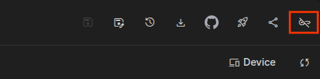
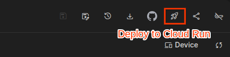
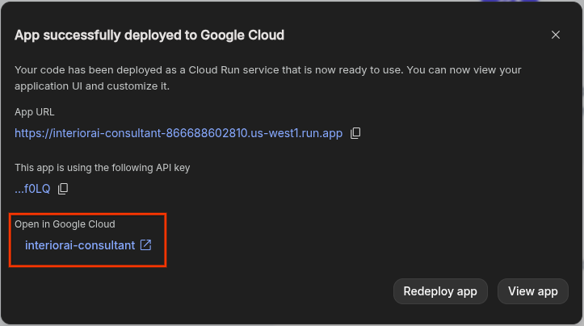
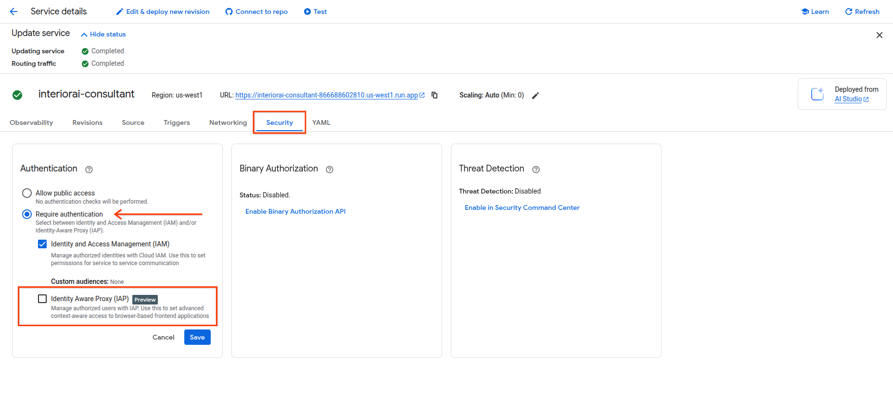
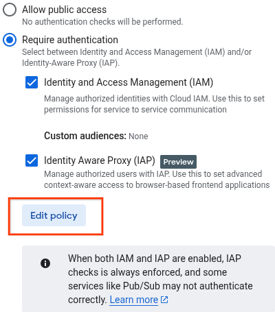

> [!NOTE] 
> TL;DR [Deploying AI Studio Apps](https://ai.google.dev/gemini-api/docs/aistudio-build-mode) to Cloud Run with your account and GCP
projects may have issues in an enterprise environment aren't applicable to external users. This guide has additional details with IAM/Security steps to aid you in your own environment.
> 
> There's a different [deployment flow within Vertex AI Studio](https://docs.cloud.google.com/vertex-ai/generative-ai/docs/start/quickstarts/deploy-vais-prompt), not covered in his document.

**Prerequisites:**

*   an awesome [applet](https://aistudio.google.com/u/1/apps)
*   [Google AI Studio API Key](https://aistudio.google.com/api-keys)
*   A GCP project
*   A billing account connected to the GCP project

**Steps completed in this guide:**
1. Enabling the Identity-Aware Proxy API
2. Granting the Default Compute Engine Service Account Cloud Storage permissions
3. Deploy the applet from AI Studio
4. Configure Authentication

Enter your project ID here: <input type="text" id="project-id" name="project-id" placeholder="YOUR_PROJECT_ID" value="YOUR_PROJECT_ID"/>

## Step 1: Enable the Identity-Aware Proxy API
Then, open
[this link](https://console.cloud.google.com/security/iap/getStarted?project=YOUR_PROJECT_ID&supportedpurview=project)
and enable the Identity-Aware Proxy API.

## Step 2: Configure permissions for Cloud Storage in your project
From your terminal, run this:
```bash
export PROJECT_ID="gen-lang-client-0478523571"
gcloud config set project $PROJECT_ID

gcloud services enable compute.googleapis.com --project=$PROJECT_ID
```

```bash
gcloud projects add-iam-policy-binding $PROJECT_ID --member="serviceAccount:$(gcloud projects describe $PROJECT_ID --format='value(projectNumber)')-compute@developer.gserviceaccount.com" --role="roles/storage.admin" --condition=None
```

## Step 3: Deploy the applet from AI Studio

Open your applet, and click on the "Key" button. Search for the GCP project you
want to deploy to and select it.  


Click the Rocket button, the project you selected previously will be preselected. Click Deploy, wait for the deployment to finish.  


## Step 4: Configure Authentication

Click the “Open in Google Cloud” link to go to the deployed Cloud Run service:  


Go to the **Security** tab. Click the **IAP** checkbox, then click **Save**:  


Click **edit policy**  


Add the email addresses of individuals or google groups you want to have access
to the applet. Ignore the ‘Access Levels dropdown.  


Click **save**. Wait a minute or two for permissions to propagate. You can now
share your applet to other users or groups!

## How to apply external env-vars after deploying or re-deploying Applets

From the terminal, run the command below. Any external env-vars you want, you
can set in the `--update-env-vars` field following the example pattern below.

<input type="text" id="applet-name" name="applet-name" placeholder="NAME_OF_DEPLOYED_APPLET" value="NAME_OF_DEPLOYED_APPLET"/>

> [!TIP]
> If you're not sure how to find it, from the same CLI you can see it by
running `gcloud run services list`.

```bash
export NAME_OF_DEPLOYED_APPLET="NAME_OF_DEPLOYED_APPLET"

gcloud beta run deploy $NAME_OF_DEPLOYED_APPLET --image=us-docker.pkg.dev/cloudrun/container/aistudio/applet-proxy --base-image=nodejs22 --region=us-west1 --iap --update-env-vars=FOO=bar,BAR=baz
```

## Other Known Issues
*   Redeploying the app from AI Studio may overwrite some configurations, env_vars *should* be preserved.

## License

Copyright 2025 Google LLC. Licensed under the Apache License, Version 2.0.