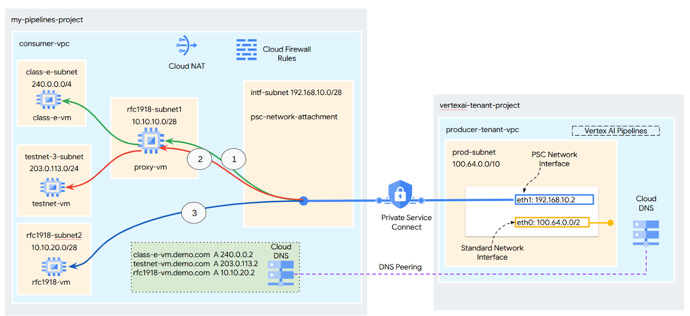
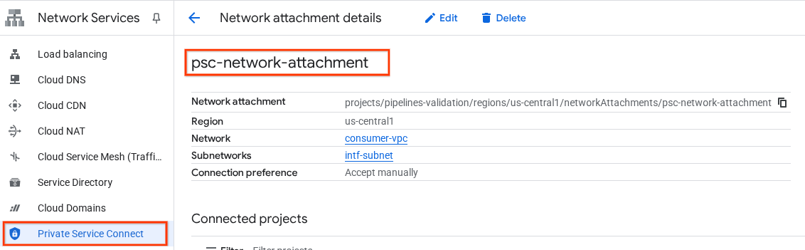
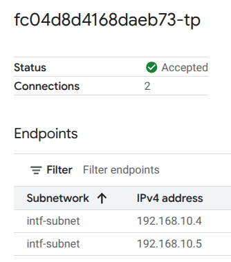
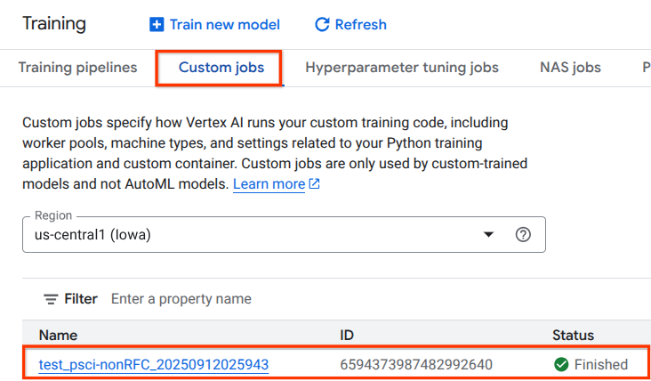
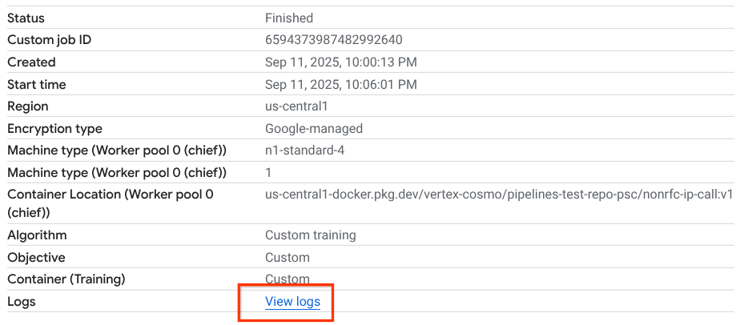
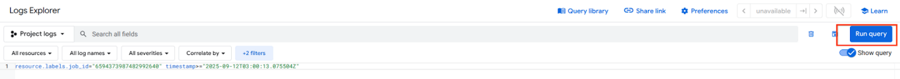
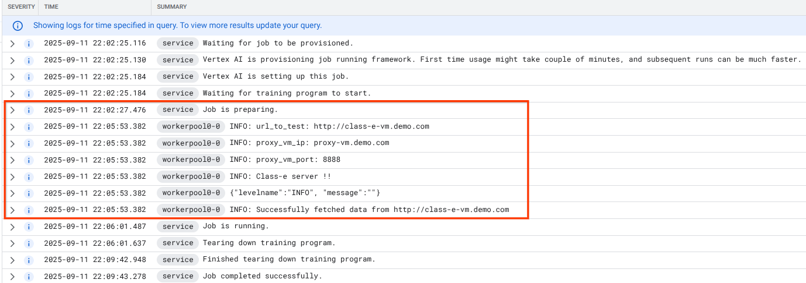

# Vertex AI Training/Pipelines PSC Interface Explicit Proxy - Terraform

This Terraform configuration automates the setup of a Private Service Connect (PSC) Interface for Vertex AI, supporting both standalone and Shared VPC architectures.

This terraform creates the resources created by this codelab: [Vertex AI Pipelines PSC Interface Explicit Proxy](https://codelabs.developers.google.com/pipelines-psc-interface-proxy)

## Overview

This module creates the necessary resources for a PSC-enabled network, including:

-   A VPC network and subnet
-   Network Attachments for PSC
-   Shared VPC configuration (optional)
-   IAM bindings for Vertex AI service agents
-   Firewall rules
-   DNS configuration (optional)
-   Proxy VM and Consumer VM (optional)
-   Vertex AI Training Job (optional)
-   Vertex AI Pipeline Job (optional)

## 1. Introduction
A Private Service Connect interface is a resource that lets a producer Virtual Private Cloud (VPC) network initiate connections to various destinations in a consumer VPC network. Producer and consumer networks can be in different projects and organizations.

If a network attachment accepts a connection from a Private Service Connect interface, Google Cloud allocates the interface an IP address from a consumer subnet that's specified by the network attachment. The consumer and producer networks are connected and can communicate by using internal IP addresses.

A connection between a network attachment and a Private Service Connect interface is similar to the connection between a Private Service Connect endpoint and a service attachment, but it has two key differences:

* A network attachment lets a producer network initiate connections to a consumer network (managed service egress), while an endpoint lets a consumer network initiate connections to a producer network (managed service ingress).
* A Private Service Connect interface connection is transitive. This means that a producer network can communicate with other networks that are connected to the consumer network.

### **Vertex AI PSC-Interface reachability considerations**

* PSC-Interface is capable of routing traffic to VPC or on-premesis based destinations within the RFC1918 address block.
* PSC-Interface targeting non rfc-1918 address blocks requires an explicit proxy deployed in the consumer's VPC with a rfc-1918 address. Within the Vertex AI deployment, the proxy must be defined along with a FQDN of the target endpoint. See figure 1 that represents the explicit proxy configured in the customers VPCs to facilitate routing to the following non rfc-1918 CIDRs: 

[1] 240.0.0.0/4

[2] 203.0.113.0/2

[3]10.10.20.0/28 no proxy required, falls into the rfc1918 range.

* When you configure your deployment with only a PSC Interface, it retains its default internet access. This outbound traffic egresses directly from the secure, Google-managed tenant network.

Figure 1


### **Vertex AI PSC-Interface VPC-SC considerations**

* When your project is part of a VPC Service Controls perimeter, the Google-managed tenants default internet access is blocked by the perimeter to prevent data exfiltration.
* To allow the deployment  access to the public internet in this scenario, you must explicitly configure a secure egress path that routes traffic through your VPC. The recommended way to achieve this is by setting up a proxy server inside your VPC perimeter with a RFC1918 address and create a Cloud NAT gateway to allow the proxy VM to access the internet.

> [!NOTE]
> **Note:** Vertex AI Pipelines deployments require an explicit proxy for Internet Egress when VPC-SC is used. If VPC-SC is not enabled, internet egress is provided through the Google managed tenant vpc.

For additional information, refer to the following resources:

[Set up a Private Service Connect interface for Vertex AI resources | Google Cloud](https://cloud.google.com/vertex-ai/docs/general/vpc-psc-i-setup#set-up-vpc-network)

### What you'll build

In this tutorial, you're going to build a comprehensive Vertex AI Pipelines deployment with Private Service Connect (PSC) Interface to allow connectivity from the producer to the consumer's compute as illustrated in Figure 1 targeting non rfc-1928 endpoints. 

Figure 2


You'll create a single psc-network-attachment in the consumer VPC leveraging DNS peering to resolve the consumers VMs in the tenant project hosting Vertex AI Training resulting in the following use cases:

1. Deploy Vertex AI Pipelines and configuring a proxy VM to act as an explicit proxy, allowing it to perform a wget against a VM in the Class E subnet.

> [!WARNING]
> **Note:** Tutorial offers configuration and validation steps based on the illustrated topology, modify the procedure as needed to meet your organization's requirements.

### **What you'll learn**

* How to create a network attachment
* How a producer can use a network attachment to create a PSC interface
* How to establish communication from the producer to the consumer using DNS Peering
* How to establish communication to non-rfc1918 IP Address space from Vertex AI Pipelines

### **What you'll need**

1. **Google Cloud Project** (One project can be used for both Networking and the Vertex AI service)
2. **IAM Permissions**
*  [Compute Network Admin ](https://cloud.google.com/iam/docs/understanding-roles#compute.networkAdmin)(roles/compute.networkAdmin)
*  [Compute Shared VPC Admin ](https://docs.cloud.google.com/iam/docs/roles-permissions/compute#compute.xpnAdmin)(roles/compute.xpnAdmin)
*  [Compute Instance Admin ](https://cloud.google.com/iam/docs/understanding-roles#compute.instanceAdmin)(roles/compute.instanceAdmin)
*  [Compute Security Admin](https://cloud.google.com/iam/docs/understanding-roles#compute.securityAdmin) (roles/compute.securityAdmin)
*  [DNS Administrator](https://cloud.google.com/iam/docs/roles-permissions/dns#dns.admin) (roles/dns.admin)
*  [IAP-secured Tunnel User](https://cloud.google.com/iam/docs/roles-permissions/iap#iap.tunnelResourceAccessor) (roles/iap.tunnelResourceAccessor)
*  [Logging Admin](https://cloud.google.com/iam/docs/roles-permissions/logging#logging.admin) (roles/logging.admin)
*  [Project IAM Admin](https://cloud.google.com/iam/docs/roles-permissions/resourcemanager#resourcemanager.projectIamAdmin) (roles/resourcemanager.projectIamAdmin)
*  [Service Account Admin](https://cloud.google.com/iam/docs/roles-permissions/iam#iam.serviceAccountAdmin) (roles/iam.serviceAccountAdmin)
*  [Service Usage Admin](https://cloud.google.com/iam/docs/roles-permissions/serviceusage#serviceusage.serviceUsageAdmin) (roles/serviceusage.serviceUsageAdmin)
3.  **Terraform** >= 1.0
4.  **gcloud CLI**

## 2. Getting Started

### 2.1 **Update the project to support the tutorial**

This tutorial makes use of $variables to aid gcloud configuration implementation in Cloud Shell. 

Inside Cloud Shell, perform the following:

```
export PROJECT_ID="your-project-id"
gcloud config set project $PROJECT_ID
```

## 3. Apply Terraform

1.  **Configure `terraform.tfvars`**:
    ```hcl
    networking_project_id = "your-networking-project-id"
    vertex_ai_service_project_ids = ["your-vertex-ai-project-1"]
    region                  = "us-central1"
    ```
2.  **Initialize and Apply**:
    ```bash
    terraform init
    terraform plan
    terraform apply
    ```

### 3.1 Terraform Configuration

| Variable | Description | Default |
|---|---|---|
| `networking_project_id` | Networking project ID (VPC Host project) | **Required** |
| `vertex_ai_service_project_ids` | Vertex AI service project ID (Can be the same as the networking project) | **Required** |
| `region` | Region for resources | **Required** |
| `network_name` | Name of the VPC network | `consumer-vpc` |
| `enable_shared_vpc` | Enable Shared VPC configuration | `false` |
| `enable_allow_all_firewall` | Enable all traffic rule | `false` |
| `all_traffic_source_ranges` | Source ranges for all traffic | `["10.0.0.0/8"]` |
| `create_nat_gateway` | If true, creates a Cloud Router and a Cloud NAT gateway in the region. | `true` |
| `create_class_e_vm` | If true, creates a class-e VM in the region. | `true` |
| `vm_zone` | The zone for the VMs. Should be in the region. | `us-central1-a` |
| `vm_machine_type` | The machine type for the VMs. | `e2-micro` |
| `create_dns_zone` | If true, creates a private Cloud DNS zone and an A record for the proxy VM. | `true` |
| `dns_zone_name` | The name of the Cloud DNS managed zone. | `private-dns-demo` |
| `dns_domain` | The DNS name of the managed zone (e.g., 'demo.com.'). | `demo.com.` |
| `create_vertex_test_container` | Enable creation of Artifact Registry repository and Cloud Build API for Vertex AI training containers | `true` |
| `artifact_registry_repository_id` | The ID of the Artifact Registry repository to create | `pipelines-test-repo-psc` |
| `image_name` | The name of the container image. | `nonrfc-ip-call` |
| `create_training_job` | If true, creates a Vertex AI **custom training job** and **pipeline** job in the service project using the created resources. | `true` |

### 3.2 Terraform Files

-   **main.tf**: Main Terraform configuration.
-   **variables.tf**: Variable definitions.
-   **outputs.tf**: Output values.
-   **terraform-example.tfvars**: Your variable values.

## 4. Enable Tcpdump

To validate IP connectivity from Vertex AI Pipelines, we can use TCPDUMP. This will allow us to observe communication originating from the PSC Network Attachment subnet, 192.168.10.0/28 when invoking the get request from Vertex AI Pipelines to the vm, class-e-vm.demo.com (240.0.0.0/4).

 From Cloud Shell ssh into the proxy vm.

```
gcloud compute ssh --zone us-central1-a "proxy-vm" --tunnel-through-iap --project $PROJECT_ID
```

 From the proxy-vm OS execute tcpdump filtering on the class-e-vm and PSC network attachment subnet.

```
sudo tcpdump -i any net 240.0.0.0/4 or 192.168.10.0/28 -nn
```

Open a new Cloud Shell tab, update your project variable and ssh into the class-e-vm

```
gcloud compute ssh --zone us-central1-a "class-e-vm" --tunnel-through-iap --project $PROJECT_ID
```

 From the class-e-vm OS execute tcpdump filtering on the proxy-vm subnet..

```
sudo tcpdump -i any net 10.10.10.0/28 -nn
```

## 5. Submit Vertex AI Training and Pipelines Jobs
The Vertex AI Training and Pipelines Job are configured to be run on a `terraform apply`. To observe communication originating from the PSC Network Attachment subnet, running `terraform apply` will kick off new Vertex AI Training jobs.
```bash
terraform apply
```

The jobs perform a wget from Vertex AI Pipelines to the explicit proxy. This allows you to reach non-RFC 1918 VMs, such as the class-e-vm. An explicit proxy is not required for Vertex AI Pipelines to access rfc1918-vm, as its target is an RFC 1918 IP address.

> [!NOTE] 
> **Note:** Upon the initial run, Vertex AI Pipelines training may take up to 15 minutes to complete after the last cell has been executed. Its status can be monitored by navigating to the following:
> 
> Vertex AI → Training → Custom jobs - [Cloud Console Link](https://console.cloud.google.com/vertex-ai/training/custom-jobs)

## 6. PSC Interface Validation
You can also view the Network Attachment IPs used by Vertax AI Pipelines by navigating to the following:

Network Services → Private Service Connect → Network Attachment → psc-network-attachment

Select the tenant project (project name ending in -tp)



The highlighted field denotes the IP address used by Vertex AI Pipelines from the PSC Network Attachment. 



## 7. Cloud Logging Validation
The Vertex AI Pipelines job will take approx 14 minutes to run the first time, subsequent runs are much shorter. To validate a successful outcome perform the following:

Navigate to Vertex AI → Training → Custom jobs

Select the executed custom job



Select View Logs



Once Cloud Logging is available, select Run Query that generates the highlighted selection below that confirms a successful wget from Vertex AI Pipelines to the class-e-vm.





## 8. TCPDump Validation
Let's review the TCPDUMP output that further validates the connectivity to compute instances:

From proxy-vm observe the HTTP GET and 200 OK

```console
03:05:34.778574 ens4  Out IP 10.10.10.2.40326 > 240.0.0.2.80: Flags [P.], seq 1:63, ack 1, win 511, options [nop,nop,TS val 1435446009 ecr 2475360885], length 62: HTTP: GET / HTTP/1.0
03:05:34.778946 ens4  In  IP 240.0.0.2.80 > 10.10.10.2.40326: Flags [.], ack 63, win 506, options [nop,nop,TS val 2475360889 ecr 1435446009], length 0
03:05:34.778974 ens4  Out IP 10.10.10.2.40326 > 240.0.0.2.80: Flags [P.], seq 63:185, ack 1, win 511, options [nop,nop,TS val 1435446010 ecr 2475360889], length 122: HTTP
03:05:34.781999 ens4  In  IP 240.0.0.2.80 > 10.10.10.2.40326: Flags [.], ack 185, win 506, options [nop,nop,TS val 2475360892 ecr 1435446010], length 0
03:05:34.906678 ens4  In  IP 240.0.0.2.80 > 10.10.10.2.40326: Flags [P.], seq 1:265, ack 185, win 506, options [nop,nop,TS val 2475361016 ecr 1435446010], length 264: HTTP: HTTP/1.1 200 OK
```

From class-e-vm observe the HTTP GET and 200 OK

```console
03:05:34.778768 ens4  In  IP 10.10.10.2.40326 > 240.0.0.2.80: Flags [P.], seq 1:63, ack 1, win 511, options [nop,nop,TS val 1435446009 ecr 2475360885], length 62: HTTP: GET / HTTP/1.0
03:05:34.778819 ens4  Out IP 240.0.0.2.80 > 10.10.10.2.40326: Flags [.], ack 63, win 506, options [nop,nop,TS val 2475360889 ecr 1435446009], length 0
03:05:34.781815 ens4  In  IP 10.10.10.2.40326 > 240.0.0.2.80: Flags [P.], seq 63:185, ack 1, win 511, options [nop,nop,TS val 1435446010 ecr 2475360889], length 122: HTTP
03:05:34.781856 ens4  Out IP 240.0.0.2.80 > 10.10.10.2.40326: Flags [.], ack 185, win 506, options [nop,nop,TS val 2475360892 ecr 1435446010], length 0
03:05:34.906503 ens4  Out IP 240.0.0.2.80 > 10.10.10.2.40326: Flags [P.], seq 1:265, ack 185, win 506, options [nop,nop,TS val 2475361016 ecr 1435446010], length 264: HTTP: HTTP/1.1 200 OK
```

## 9. Cleanup

> [!NOTE]
> **Note:** You can delete the PSC Network Attachment and subnet once the Vertex AI Pipeline has not been used for at least one hour.

**Preferred method**

```bash
terraform destroy
```

**Alternative method**

Alternatively you can use gcloud commands from Cloud Shell to delete tutorial components.

```
gcloud compute instances delete proxy-vm --zone=us-central1-a --quiet
gcloud compute instances delete class-e-vm --zone=us-central1-a --quiet

gcloud compute routers delete cloud-router-for-nat --region=us-central1 --quiet

gcloud compute network-attachments delete us-central1-vertex-psci --region=us-central1 --quiet

gcloud compute networks subnets delete intf-subnet rfc1918-subnet1 --region=us-central1 --quiet

gcloud dns record-sets delete class-e-vm.demo.com --zone=private-dns-codelab  --type=A
gcloud dns record-sets delete proxy-vm.demo.com --zone=private-dns-codelab  --type=A

gcloud dns managed-zones delete private-dns-codelab
gcloud compute networks delete consumer-vpc --quiet
```

## Congratulations

Congratulations, you've successfully configured and validated a Private Service Connect Interface with Vertex AI Pipelines. 

You created the consumer infrastructure, and you added a network attachment that allowed the producer to create a multi nic vm to bridge consumer and producer communication. You learned how to create DNS peering while deploying an explicit proxy in the consumer VPC network that allowed connectivity to the class-e-vm instance that is not routable directly from Vertex.

Major Kudos for **Deepak Michael**, author of the original [codelab](https://codelabs.developers.google.com/pipelines-psc-interface-proxy).

## Additional Resources

-   [Set up a Private Service Connect interface for Vertex AI resources](https://cloud.google.com/vertex-ai/docs/general/vpc-psc-i-setup)
-   [Use Private Service Connect interface for Vertex AI Training](https://docs.cloud.google.com/vertex-ai/docs/training/psc-i-egress)
-   [Codelab: Vertex AI Pipelines PSC Interface Explicit Proxy](https://codelabs.developers.google.com/pipelines-psc-interface-proxy)
-   [Shared VPC Documentation](https://cloud.google.com/vpc/docs/shared-vpc)
-   [Network Attachments Documentation](https://cloud.google.com/vpc/docs/about-network-attachments)

## License

Copyright 2025 Google LLC. Licensed under the Apache License, Version 2.0.
