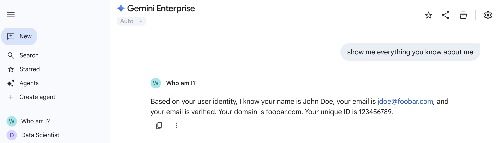

## Acknowledgements
*   Original source from Hai Ning [Whoami ADK Agent](https://github.com/hning86/adk-whoami)

# Whoami ADK Agent 

Whoami is a sample ADK agent, when registered in Google's Gemini Enterprise, that can capture end user's basic information such as email, name etc. (assuming user uses Google identity to log in). Here is whoami in action.



The purpose of this sample agent is to show how to build OAuth flow in ADK agent deployed in Agent Engine and registered with Gemini Enterprise.

## Step by step guide

### 1. Create `agent.py` file.

A sample `agent.py` is already provided for you in the `whoami` subdirectory, along with `.env` and `__init__.py` file. This is standard ADK agent affair. 

Pay attention to the `AUTH_ID` constant in the `agent.py`. You can enter any arbitary name. But rememember this value will be visible to the end user when he/she authorize the OAuth flow. Also it should be unique every time you deploy the agent. Otherwise you might see issues related cached values.

Also, notice that the auth token is captured in the `ToolContext` object when tool is invoked. It is used to access user information from the Google OAuth2 API.

### 2. Deploy agent
Deploy the agent with Vertex AI Agent Engine. Make sure you record the resource ID after deployment is succecessful.

```sh
# run this from the folder where whoami is a sub folder
adk deploy agent_engine --display_name "Whoami" --staging_bucket=gs://<staging_bucker> whoami
```

### 3. Create an OAuth Client

In GCP Console Google Auth Platform, create a new OAuth client. 
1. Choose Web Application type, and enter an arbitary name for the client.
2. Add `https://vertexaisearch.cloud.google.com/oauth-redirect` as authorized redirect URI. 
3. Add a Client Secret, and record the Client Id and Client Secret, to be used later. 
4. Download the client secret json file locally as `client_secret.json`. 

### 4. Generate Authorization URI

Run the `generate_auth_uri.py` script to generate OAuth authorization URI. Make sure the script can access the `client_secret.json` file you downloaded from step 3. 

Also pay attention to the scopes. These 2 scopes ask for permission to access user's email address and other basic information such as name. 
1. `https://www.googleapis.com/auth/userinfo.email`
2. `https://www.googleapis.com/auth/userinfo.profile`

If you need other permissions, refer to [OAuth 2.0 Scopes for Google APIs](https://developers.google.com/identity/protocols/oauth2/scopes).

### 5. Create Authorization Resource in GCP

Modify the `create_auth.sh` file. Enter the following values:
1. PROJECT_NUMBER: GCP Project Number.
2. AUTH_ID: Auth ID chosen in step 1.
3. OAUTH_CLIENT_ID: Client ID from step 3.
4. OAUTH_CLIENT_SECRET: Client Secret from step 3.
5. OAUTH_AUTH_URI: The output from step 4.

After you fill in the correct values, run the script. This script will create the Authorization Resource object in your GCP project. And your registered agent will reference it in the next step.

```sh
sh create_auth.sh
```

### 6. Register the agent.

Use the [Agent Registration tool](https://github.com/VeerMuchandi/agent_registration_tool) to register the deployed agent with your Gemini Enterprise instance. Make sure you supply the `AUTH_ID` value to the registration configuration. This ensures your agent inject the auth token into the `ToolsContext` object when making the tool call.

### 7. Time to party.

Invoke the whoami agent from Gemini Enterprise, ask the agent to tell you everything about you, and see how it invokes Authorization flow, and replies with your email and name.
